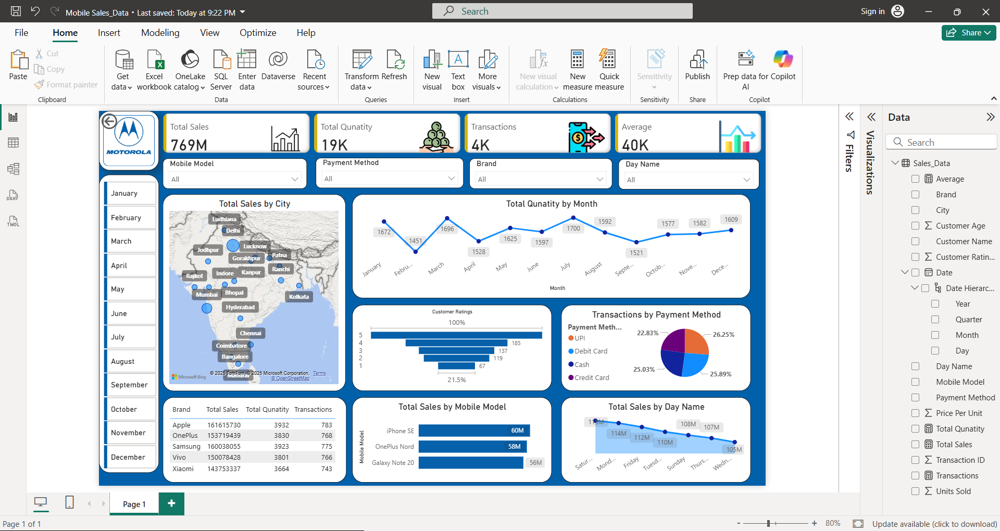

# 📊 Mobile Sales Data Dashboard

A Power BI dashboard visualizing mobile phone sales data across different cities, brands, payment methods, and more.

## 🔍 Features

- Total sales and quantity trends
- Interactive filters by brand, model, and date
- Map showing total sales by city
- Monthly quantity trend line
- Payment method breakdown (pie chart)
- Bar charts for customer ratings, sales by day and model

## 🖼️ Preview

## 🗂️ File

- `Mobile_Sales_Data.pbix`: The Power BI dashboard file

## 📎 Tools Used

- Microsoft Power BI
- Excel (for data preparation)
- GitHub (for version control and sharing)
